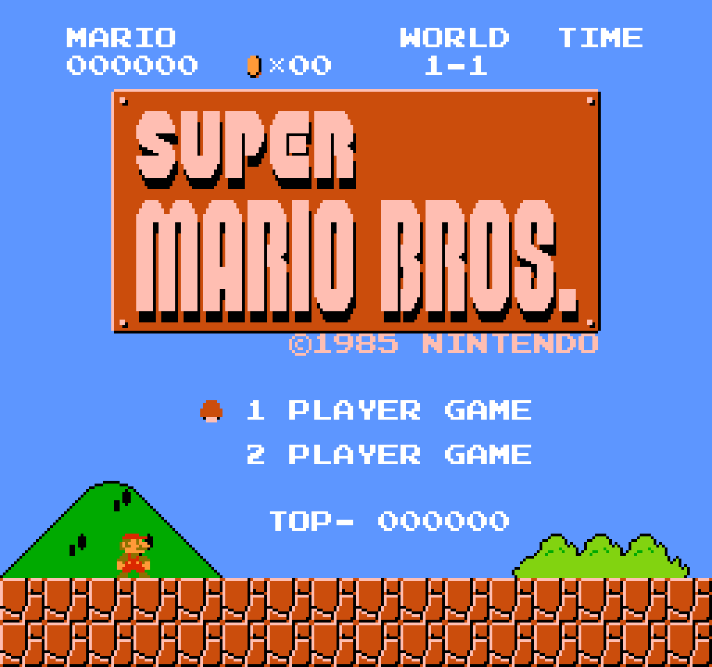
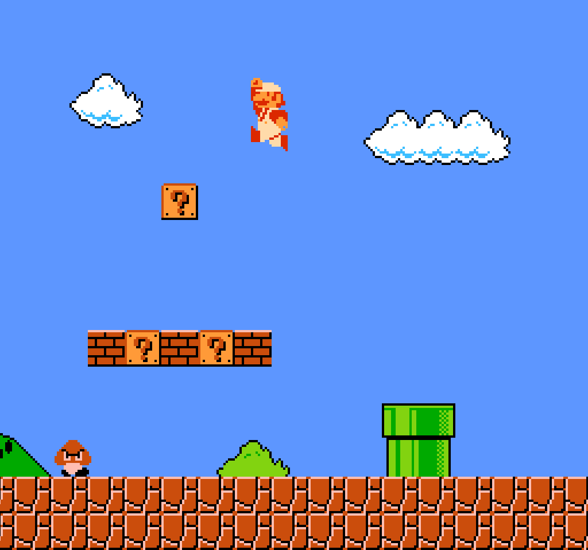
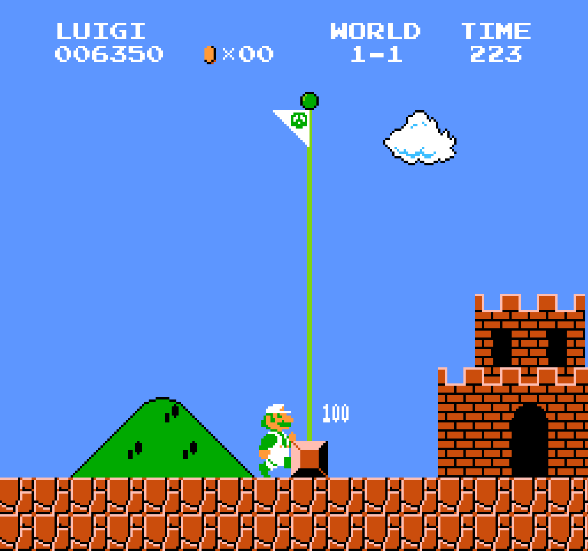

# Super Mario Bros (Authentic Clone)

A precision-focused, reverse-engineered recreation of the original *Super Mario Bros.*  
This project targets cycle-accurate behavior, preserving every quirk, exploit, and low-level detail that defined the NES release. If a speedrunner or TAS author can do it on hardware, they can do it here.

---

## 🎯 Objective
Replicate the original engine without reinterpretation. This is not a remake or modernization—this is behavioral authenticity. Physics, rules, bugs, palettes, and rendering choices align with the real thing.

---

## 🧩 Technical Accuracy

### Collision & Physics
- Interaction-point collision exactly like the NES routine
- 1:1 acceleration, movement curves, and turnaround rules
- All edge-cases preserved—no smoothing, no revisionism

### Rendering Fidelity
- Palette-driven rendering rather than hard-colored textures
- Object-parsed level data instead of handcrafted tilemaps
- Animation pacing tied to original frame sequencing

### Level & Object Logic
- Reverse-engineered object interpretation
- Maze evaluation behaves like the NES
- Object parsing controls spawns, interactions, and placement

### Two-Player Behavior
- Mario/Luigi alternating-turn gameplay fully implemented
- Toggle available on the title screen, matching original UX

---

## 🐛 Intentional Bugs & Glitches (All Included)
If it was abusable in 1985, it’s abusable here:
- Flagpole glitch
- Full flagpole glitch
- Minus World and wrong-warp paths
- Other timing-dependent micro-quirks intact

If it broke the game on NES, it breaks the game here.

---

## 🎮 Input Support
- Full controller input support
- Configurable bindings
- Keyboard remains available for convenience

---

## 🎥 TAS Support
- Deterministic input playback
- Frame-perfect command scripting
- Built for experimentation and route discovery

Perfect for runners validating setups, testing theories, or hunting new tech.

---

## 🧪 Use-Cases
- Speedrunning practice
- TAS production
- Mechanics research
- Reverse-engineering reference
- Authenticity benchmarking
- Fun

---

## 🛠️ Implementation Notes
- **Language:** C++
- **Rendering and Audio:** SFML
- **Platform:** Windows

---

## 🖼️ Screenshots

  

  

  

  

---

## 📜 Legal
This is a technical study. No copyrighted assets or source code from Nintendo are distributed.  
Users must supply their own legally obtained resources where required.